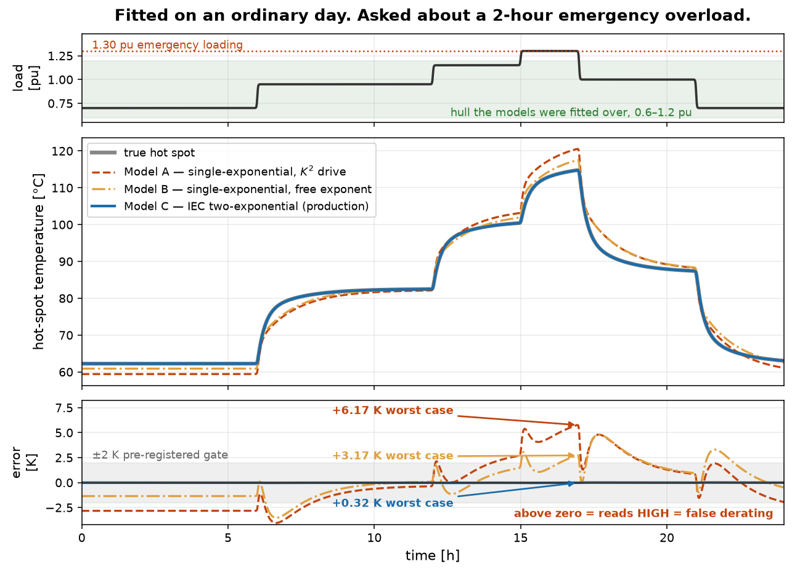
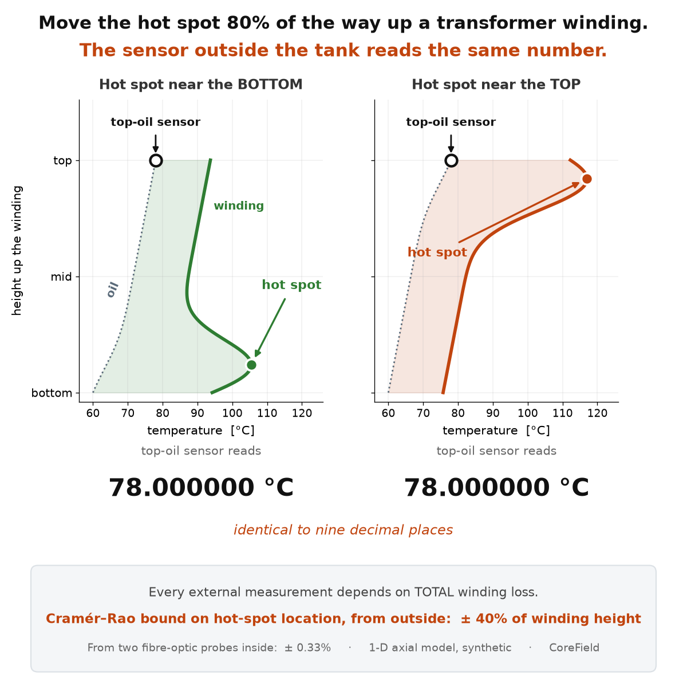

# CoreField

**Transformer winding hot-spot estimation and dynamic loading envelopes, from three signals
a utility already logs.**

Load current, ambient temperature, top-oil temperature. From those plus a handful of hot-spot
calibration reads, CoreField identifies the four IEC 60076-7 thermal parameters
(Δθ_or, τ_o, Δθ_hr, τ_w) for a specific unit, then runs the identified model in service to
answer the question that carries commercial value: **how much extra load can this transformer
carry, and for how long?**

Those four parameters are the ones the standard says can otherwise only be obtained from a
prolonged heat-run test on a transformer fitted with fibre-optic sensors.

**This is a complement to that test, not a replacement for it.** For a new transformer the
heat-run is part of procurement verification and characterises the unit as built. What it cannot
do is follow what the unit has *become* after twenty years of service, and it was never performed
at all on most of the installed fleet. Those two cases — the aged unit and the undocumented one —
are what this addresses. The framing was corrected on the advice of a reviewer who builds thermal
models for a transmission operator; the earlier "replaces the heat-run test" was overreach.

---

> ## ⚠ TWO THINGS TO READ BEFORE ANYTHING ELSE
>
> **1. IEC 60076-7 provenance.** The two-exponential structure and the ONAF constants were
> checked against the published text of IEC 60076-7:2018 Edition 2.0 on 25 Aug 2026 and **match
> it** — all five cooling-class constants, both tabulated time constants, and the assignment of
> each time constant to its branch. Three numerical checks in `corefield.verification` confirm
> that assignment independently of any document.
>
> **This repository reproduces no text, table or figure from the standard.** IEC standards are
> copyrighted and sold. If you claim standards compliance, hold your own copy from an authorised
> distributor — the constants here are used as engineering facts, not as a substitute for it.
>
> **2. Field validation: none.** Every number in this repository was produced from synthetic
> data. No measurement from a real transformer has ever entered it. See
> [Limitations](#limitations) — that section is not softened, and should not be.

---

## The result that chose the production engine

Three model structures were fitted on the same ordinary day (0.6–1.2 pu), then asked about a
2-hour emergency overload at **1.30 pu** — outside the load range they were fitted over.

| Model | Structure | RMSE | Worst-case peak error at 1.30 pu | Verdict |
|---|---|---|---|---|
| A | single-exponential, K² drive | 2.59 K | **+6.17 K** | FAIL |
| B | single-exponential, free exponent | 1.77 K | **+3.17 K** | FAIL |
| **C** | **IEC two-exponential** | **0.11 K** | **+0.32 K** | **PASS** |

This separation belongs to **ON.. cooling classes**, where `k21 = 2.0` gives the winding a
transient overshoot that only a two-exponential model can follow. For **directed-flow (OD/ODAF)**
units the standard sets `k21 = 1.0`: the slow branch vanishes, the overshoot with it, and the
three models converge. Do not quote this table for a directed-flow transformer.



Models A and B read the hot spot several kelvin **high** at high load — triggering derating
exactly when spare capacity is worth the most. That is the commercial argument, and it is why
the production engine is classical nonlinear least squares on the IEC two-exponential structure
rather than anything more fashionable.

Two things make this table stronger than it looks. Models A and B were driven by the
**noise-free** top-oil signal while Model C had to fit a noisy one — the comparison is
handicapped in their favour and they still fail. And every value is **re-derived on every test
run** rather than quoted: `python -m pytest` reproduces the whole campaign in about 17 seconds.

## Quickstart

```bash
pip install -e .
```

```bash
python -m pytest
```

Get a blank telemetry file to hand to a site engineer:

```bash
corefield --template site_A.csv
```

Check whether a filled-in record can support a fit — before fitting anything:

```bash
corefield validate site_A.csv
```

Run the demo:

```bash
pip install -e ".[app]"
```

```bash
streamlit run app/streamlit_app.py --server.address localhost
```

`--server.address localhost` is not optional housekeeping. Streamlit binds to all interfaces by
default and prints an external URL, which on a laptop sharing a conference or client network
means anyone on it can open your demo — including whatever telemetry you last uploaded. Bind to
localhost unless you have deliberately decided otherwise.

### In Python

```python
from corefield.ingest import load_telemetry
from corefield.estimator import identify
from corefield.envelope import LoadingLimits, loading_envelope
from corefield.iec60076_7 import InitialState

frame = load_telemetry("site_A.csv")
print(frame.report.report())        # the gate: sampling, coverage, load hull, load events
frame.require_fittable()            # refuses records that cannot determine four parameters

result = identify(
    frame.time_s, frame.load_pu, frame.ambient_C, frame.top_oil_C, frame.hotspot_refs
)
print(result.report())

limits = LoadingLimits(
    hotspot_limit_C=...,            # from YOUR licensed copy of the standard
    top_oil_limit_C=...,
    label="normal cyclic loading, medium power",
    source="IEC 60076-7:2018 Table N, licensed copy, checked 2026-08-24 by AB",
)
envelope = loading_envelope(
    result.params, limits, ambient_C=30.0, duration_h=2.0,
    initial_state=InitialState(top_oil_C=70.0, prior_load_pu=0.9),
    nameplate_MVA=63.0,
)
print(envelope.summary())
```

## What the package refuses to do

These are design decisions, not gaps.

**It will not fit without ambient.** Ignoring a varying ambient under-predicts the hot-spot peak
by **3.09 K** — in the dangerous direction, because the ambient maximum coincides with the
afternoon load peak. `load_telemetry` raises `AmbientMissingError` rather than warning. The fix
is cheap: ambient reaches the winding through a ~75-minute oil low-pass, so an hourly public
weather feed is sufficient.

**It will not supply loading limits.** `LoadingLimits` has no defaults and
`iec_loading_limits()` exists only to raise `NotImplementedError` explaining why. This is
unchanged by the constants having been checked: verifying Table 4's *thermal characteristics*
says nothing about the *permissible temperature limits*, which are a different table and were
deliberately not read. More importantly, the limits decide the temperature at which this
software tells an operator it is safe to overload a transformer, and they vary with loading type,
transformer category and each utility's own policy. That number must be owned by the person
relying on it. You supply the limits and a provenance string, and that string travels into every
result.

**It will not return a railed fit.** If every optimiser start converges onto a bound,
`identify` raises rather than returning the best of a bad set. A solution pinned to a bound is an
optimiser artifact that a caller cannot distinguish from a measurement. During this project's
history an independent implementation railed its optimiser in 9 of 9 runs and reported the result
as evidence of an identifiability problem in the physics; it was an implementation failure.

**It will not interpolate observations.** Load and ambient are model *inputs* and are
interpolated onto the integration grid. Top-oil is an *observation* and is not — interpolating it
would invent measurements and correlate their noise, making the residual RMSE flatter than the
data earns.

**It contains no neural networks.** That is a result, not a preference: see the table above, and
[WITHDRAWN.md](WITHDRAWN.md) for the geometry-PINN branch that was retracted.

## What the analysis established

**Efficiency.** On the IEC two-exponential structure, the four-parameter estimator is unbiased to
better than 0.12 % and **sits on the Cramér–Rao bound** — 0.97 / 1.01 / 0.95 / 0.97× the
folded-Gaussian expectation at 400 seeds. No estimator, classical or learned, can do materially
better on this data.

**Commissioning.** The bound is a property of the *record*, not the method, so it yields an
actionable spec. One load event leaves a ~12 % floor under τ_w that nothing can beat; two events
drop it to ~4 %. **Commission over at least two load events.** Take calibration reads at 3, 8, 18
and 48 minutes after each load change, plus one after ~4 h of steady load — the first three carry
the *rate*, the 48-minute point anchors the *amplitude*, and sampling a transient without
anchoring its own asymptote leaves the two correlated.

**Sampling rate.** Load sampling dominates; oil sampling barely matters. τ_w error is +2.1 % with
1-minute load logging and **+8.4 % with 5-minute** — the ~90-second load ramps get aliased.
Insist on 1-minute load current; 5-minute top-oil is fine.

**The quiet failure modes are the dangerous ones.** Telemetry spikes and integer-degree
quantisation cost nothing — a dense oil channel drowns them. Slow sensor drift and systematic
calibration bias are invisible on any plot and poison the *parameters* while the trajectory still
passes its gate. A winding-temperature-indicator replica reading +3 K high produces an engine
that looks perfectly calibrated against that replica while carrying +14.5 % on Δθ_hr and +4.1 K
at the true peak — and it distorts the *dynamics*, not just the level, so a "relative trends
only" positioning does not escape it. **Commissioning requires at least one bias-audited hot-spot
reference per unit.**

**Hot-spot *location* is not observable from outside.** Top-oil is exactly invariant to where in
the winding the hot spot sits — moving it from 10 % to 90 % of winding height changes the reading
by 0.0000000 K, because every external measurement is a function of *total* winding loss and
location changes only its distribution. The Cramér–Rao bound on location from every external
channel combined is ±40 % of winding height; two probes inside the winding give ±0.33 %. See
[ASSESSMENT.md](ASSESSMENT.md); this is why the package has no field-reconstruction module.



## Limitations

**Read this section before quoting anything from this repository.**

1. **Everything here is synthetic. There is no field validation whatsoever.** Every parameter
   recovery, every RMSE, every gate verdict was computed against a truth model this package also
   generated. The estimator has never seen a real transformer.
2. **Model C is structure-matched to the synthetic truth.** The mismatch test killed models A and
   B; it did not test C. The day-C result certifies parameter-error propagation under
   extrapolation — it does not certify structural risk on a real unit whose physics may differ
   from the standard's.
3. **One synthetic unit.** A single illustrative ONAF-scale parameter set. No unit-to-unit
   spread, no cooling-class variation beyond a constants swap, no ageing.
4. **IEC text is mirror-sourced and unverified** (see the banner above).
5. **Corruption magnitudes are plausible instrument bounds, not measured values.** Drift, spike
   rate, CT gain error and calibration bias were chosen as engineering estimates.
6. **The uncertainty band covers parameter error only.** It excludes model structural error and
   ambient/load forecast error, and it is drawn from the Cramér–Rao bound, which is a *lower*
   bound on estimator covariance. True uncertainty is larger than reported.
7. **WTI bias was tested as a constant offset.** Gain-type or load-dependent replica error is
   untested.
8. **The observability analysis in `corefield.observability` uses a simplified 1-D axial model**
   with a prescribed oil-rise profile, not CFD. Its leading-order conclusion follows from energy
   conservation and is robust to that simplicity; its second-order magnitudes are not.

## Documentation

| File | What it holds |
|---|---|
| [REPRODUCTION.md](REPRODUCTION.md) | Which published numbers reproduce, which do not, and why |
| [ASSESSMENT.md](ASSESSMENT.md) | Prior-art review, and why 2D/3D field reconstruction was not built |
| [EVIDENCE.md](EVIDENCE.md) | (a)/(b)/(c) label index for every claim in this README |
| [PREDICTIONS.md](PREDICTIONS.md) | Pre-registered prediction ledger, misses kept |
| [WITHDRAWN.md](WITHDRAWN.md) | The retracted geometry-PINN branch and its mesh-convergence failure |
| `docs/` | Figures, regenerated from the package by `python scripts/make_readme_figures.py` |

## Requirements

Python 3.11+, NumPy, SciPy, pandas. CPU-only — measured at 137 MiB peak resident memory for the full campaign, against a 2 GB budget. No GPU, no
network, no paid services. The demo adds Streamlit and Matplotlib.

## Licence

**Code** — Apache License 2.0. See [LICENSE](LICENSE). Apache-2.0 rather than MIT for its
explicit patent grant and its requirement that modifications be marked; both matter for
engineering software that may end up in a regulated decision path.

**Documentation** — Creative Commons Attribution 4.0 International. See
[LICENSE-docs](LICENSE-docs). The prose files carry the evidence and the retractions, and CC BY
lets them be quoted and built on with attribution intact.

See [NOTICE](NOTICE) for the attribution notice, the split between the two licences, and two
things the licences do not cover: **no IEC standard text is redistributed here**, and **nothing
in this repository has been validated against a real transformer**. Loading decisions on
electrical plant carry safety and asset consequences; this software must not be the sole basis
for one.
